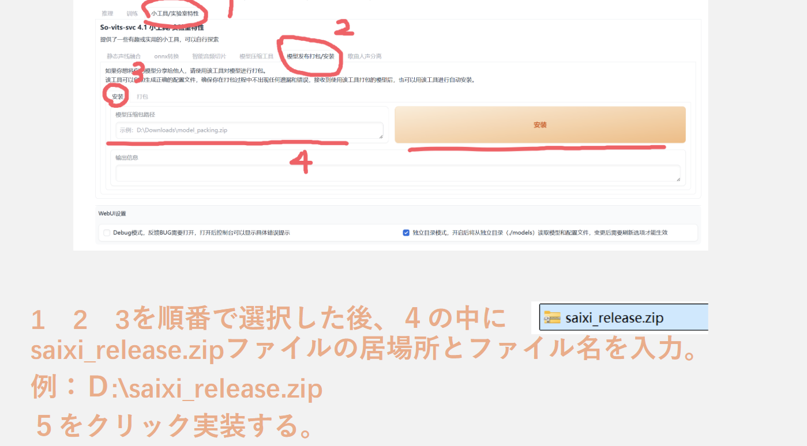

# SVC

so-vits-svc(SoftVC VITS Singing Voice Conversion)とUVR5(Ultimate Vocal Remover)を使って、訓練した成果だ。

深層学習ベースの歌声変換ツールである so-vits-svc を使用し、独自の音声モデルを制作しました。

制作にあたっては、音声素材の整理、ノイズ除去、データセット作成、モデル学習、推理、音声調整まで一連の工程をやりました。

完成したモデルを用いて楽曲の歌声変換を行い、AI音声技術を活用した音楽作品を制作しました。

# 免責事項

本作品は制作者本人の責任において制作したものです。本作品の使用によって生じたいかなる結果についても、so-vits-svc のリポジトリ作者、コントリビューター、および関連する統合パッケージの作者は一切の責任を負いません。

# モデルの注意点

音声モデルを使って、音声生成する場合：so-vits-svcを実装することは必要だ。バージョンはSo-VITS-SVC 4.1

# 音声素材

あるVUPの許可を貰った。そのVUP提供した音声ファイルで、データセットを訓練した。音声素材の使用範囲は：研究目的だけ

# 内容説明

样本1_01.wav　は音声提供者の一部分の音声素材でした。

中国語.wav　は訓練した音声モデルで、テキスト「文字入力で音声入力ではなく」から推理生成した中国語のAI音声

84800合成 混音 1.wav　は訓練した音声モデルで、音楽Ｂ《5_20AM》を入力、推理生成した歌音声。「2分37秒後は空白」

音楽Ｂ《5_20AM》　はサンプルとした音楽でした。

# モデル

サイズの原因、Google Drivehttpsにアプロードした。

https://drive.google.com/drive/folders/1lmT3LGycNdTi8Lycg55kQ4pLomFFnkbS?usp=sharing

# モデルの使用方法

「もしダウンロードしたバージョンが以下の機能はない場合、モデルファイルをそれぞれ対応のフォルダに入れて使用も可能」

